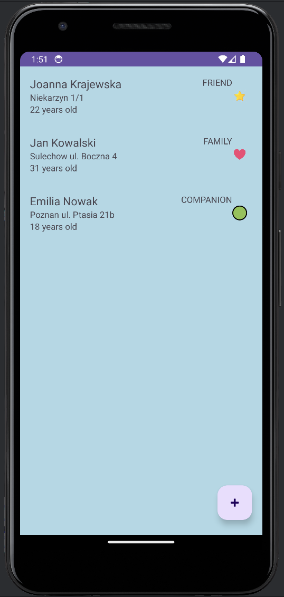

# Guest List App

## Description

The Guest List App allows you to manage a list of guests invited to various occasions such as parties or meetings. It enables adding, editing, and removing information about guests.

## Features

- **Adding new guests:** You can add a new guest with basic information such as name, age, address, and category (family, friends, companion).
- **Editing guest information:** You can edit any information of a guest by clicking on their entry in the list.
- **Deleting guests:** You have the option to remove a guest from the list.
- **Viewing the guest list:** Displays a list of all added guests with the ability to view detailed information.

## How to Use?

1. **Adding a guest:** To add a guest, click the "Add Guest" button and fill out the form.
2. **Editing a guest:** Click on a guest in the list to open the editing screen.
3. **Deleting a guest:** Long press on a guest in the list to bring up deletion options.

## Screenshots

*Guest list view*

*View for adding a new guest*

## License

This project is released under the MIT License.
